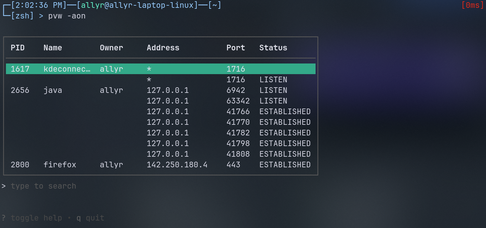

# pvw
pvw is a port viewer TUI for Unix made with BubbleTea in Go.  

  

## Installation
The recommended way to install pvw is with [eget](https://github.com/zyedidia/eget):
```bash
sudo eget allyring/pvw --to /usr/local/bin
``` 

However, you can manually install it by downloading the latest binary from the releases tab
and moving it to any location on your $PATH.


pvw also relies on `lsof` version 4.94 or later being installed on your system. Many systems ship with it, but if not, then it can be
installed through your standard package manager.

## Usage
Run with `pvw` followed by any flags/switches. Run `pvw -h` or `pvw --help` for help.

## Contribution and Credits
If you would like to contribute, then feel free to create an issue or PR with a bug report/fix or improvement!

Thanks to @dlvhdr for the idea in the [charmbracelet/inspo](https://github.com/charmbracelet/inspo) repo, as well as
everyone in the [Charm Discord server](https://charm.sh/chat) for helping answer my questions.

### Future features:
- Better IPv6 support
- Save data to JSON
- Resizable table in config
- Custom default configs?

